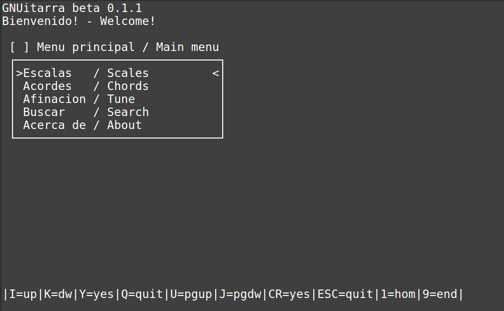
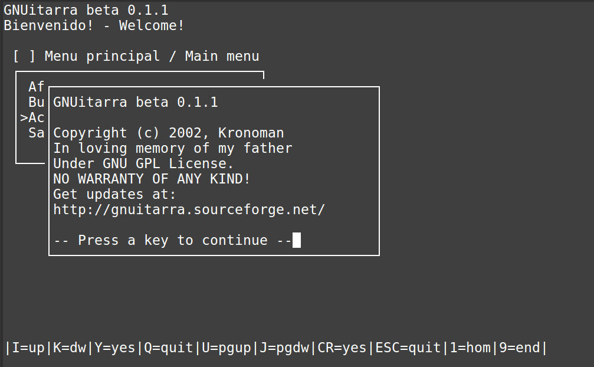
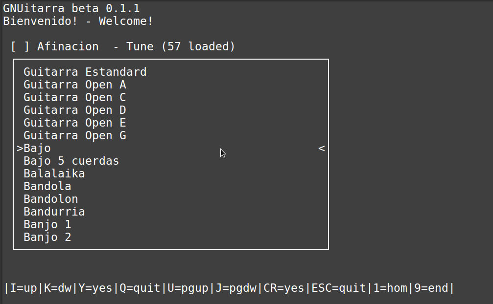
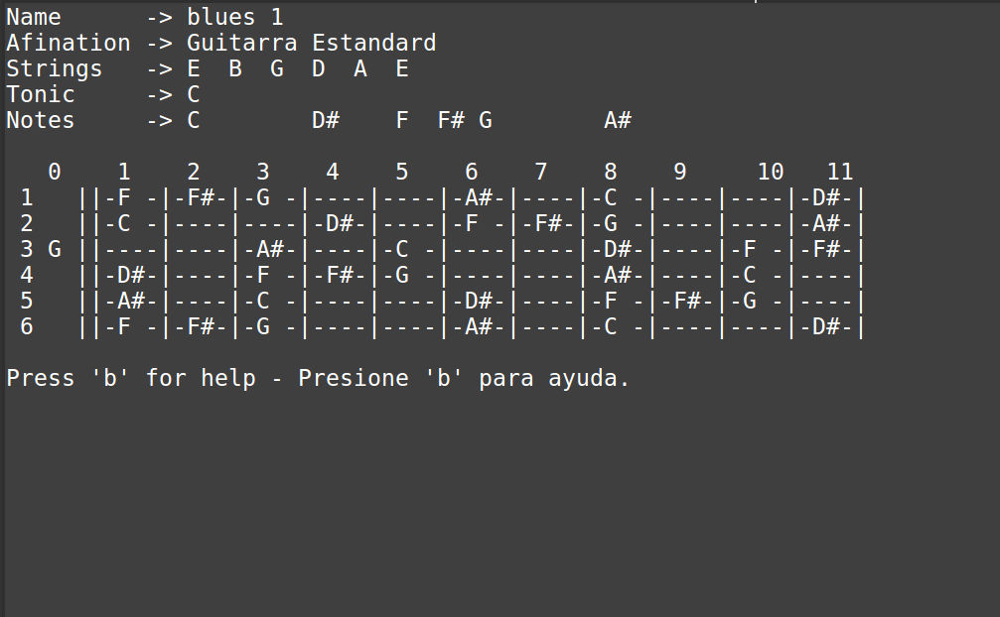
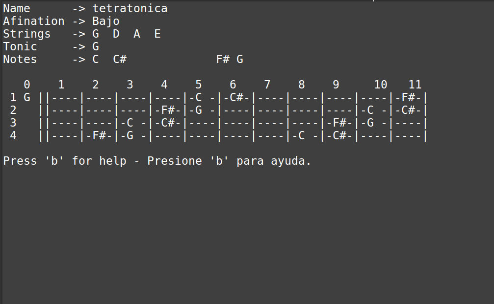
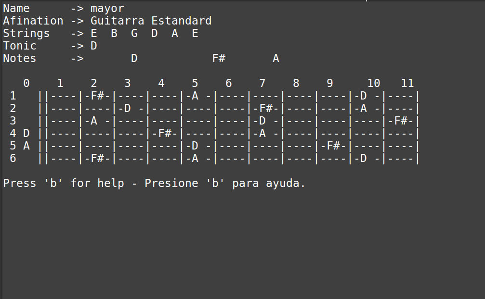

# KRONO's GNUitarra

Krono's GNUitarra is a light-fast, all-in-one helper for the guitar and string instrument musical player.

Supports lots of instruments!

Guitarra, bajo, Balalaika, bandola, banjo, Bozouki, Cavaquinho,Charango,  cuatro, dulcimer, guitarra portuguesa, guitarron, hawayana, flamenca, jarana, laud, mandola, mandolina, sitar, timple, tres, ukelele, vihuela, etc

Has more than +4000 scale types, +60 chord types, +60 string instruments (i.e bass). 

Can automake solos, learning excersises, etc. 

Works even in a 386!

For MS-DOS, Windows, Linux

Copyright (c) 2002-2019, Kronoman

Programmer,Graphics,Documentation,Package,Web:
	Alvaro "Kronoman" Gonzalez

# Features

Very fast, low memory, low disk footprint, runs on very cheap hardware!

+4000 scales

+60 chord types

+60 instruments: guitarra, bajo, Balalaika, bandola, banjo, Bozouki, Cavaquinho,Charango,  cuatro, dulcimer, guitarra portuguesa, guitarron, hawayana, flamenca, jarana, laud, mandola, mandolina, sitar, timple, tres, ukelele, vihuela, etc

# Screenshoots

Running on Linux Mint console

## Compilation

### Linux

Linux users: READ THIS!!

Quick and dirty instructions:

For making the program, you *need* the *Ncurses* library.

Install on Linux with

	$ sudo apt-get install libncurses5-dev libncursesw5-dev

or

	$ sudo yum install ncurses-devel

To make the program:

	$ cd src
	
	$ make

After that, just copy the executable and all datafiles/* in
the SAME directory, and run it... enjoy... :)

### MS-DOS

DJGPP (DOS) users: READ THIS!!

For making the program, you *NEED* the *PDCurses* library.

https://pdcurses.org/

Example: pdcur24b.zip

For use it, just run

	> cd src
	
	> make -f makefile.dj
	
### WINDOWS

You can use DosBox to enjoy this software on Windows. Works perfect!

## Documentation

The documentation is in doc/*
Read it please.

## DISCLAIMER

This program is free software; you can redistribute it and/or modify
it under the terms of the GNU General Public License as published by
the Free Software Foundation; either version 2 of the License, or
(at your option) any later version.

This program is distributed in the hope that it will be useful,
but WITHOUT ANY WARRANTY; without even the implied warranty of
MERCHANTABILITY or FITNESS FOR A PARTICULAR PURPOSE.  See the
GNU General Public License for more details.

You should have received a copy of the GNU General Public License
along with this program; if not, write to the Free Software
Foundation, Inc., 59 Temple Place, Suite 330, Boston, MA  02111-1307  USA

